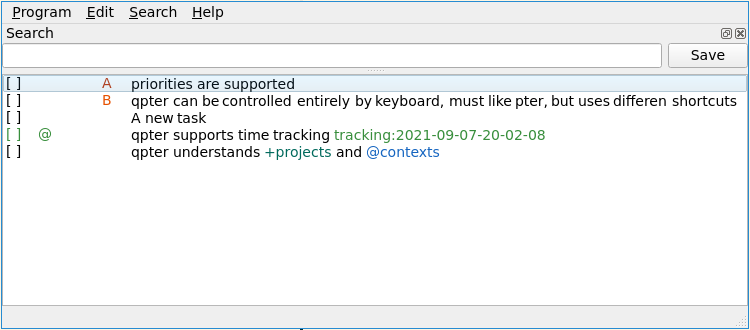

# pter

Your console and graphical UI to manage your todo.txt file(s).

Also in this package, the QT5 based graphical user interface, qpter.

pter has a bunch of features that help you managing your todo.txt file:

 - Fully compatible to the todo.txt standard
 - Support for `due:`, `h:`, `t:`
 - Save search queries for quick access
 - Convenient entering of dates
 - Configurable behaviour, shortcuts, and colors
 - Time tracking

There is also a graphical user interface called qpter.

## Installation

### Install from PIP

To install pter you can either clone the repository (see at the end) or, much 
simpler, use pip to install it:

    pip install pter

If you want to use the Qt GUI qpter, you have to install PyQt5:

    pip install PyQt5

## Using pter

To launch pter you have to tell it where your todo.txt file is:

    pter ~/todo.txt

For the graphical user interface (requires QT), you have to start it like 
this:

    qpter ~/todo.txt

Both will give you a listing of all your tasks order by how soon they will be 
due and what priority you have given them.

You can navigate the tasks with your cursor keys and edit selected tasks by 
pressing `e`.

More default shortcuts are:

 - `e`, edit the selected task
 - `n`, create a new task
 - `d`, mark the selected task as done (or toggle back to not done)
 - `?`, show all keyboard shortcuts
 - `q`, quit the program

There is a complex search available (have a look at the manual for details), but the short version is:

 - press `/` to enter your search terms
 - search for `done:n` to only show incomplete tasks
 - search for a context with `@context`
 - search for a project with `+project`
 - search for tasks that do not belong to a context with `-@context` or `not:@context`
 - press `Return` to return the focus to the task list

## Using qpter

To launch the Qt GUI, you may (but don’t have to) provide the location of your 
todo.txt file:

    qpter ~/todo.txt

# Where did the source code go?

The original idea to keep this project at github was nout the greatest idea and I’ve 
moved it over to [codeberg](https://codeberg.org/vonshednob/pter).

This placeholder remains though to keep track of the remaining issues (and 
be able to inform the folks that raised the issues).

However, just like with any other open source project, you’re invited to 
participate in pter’s development. Any contribution is welcome, from bug 
reports to pull requests/sending of patches!
